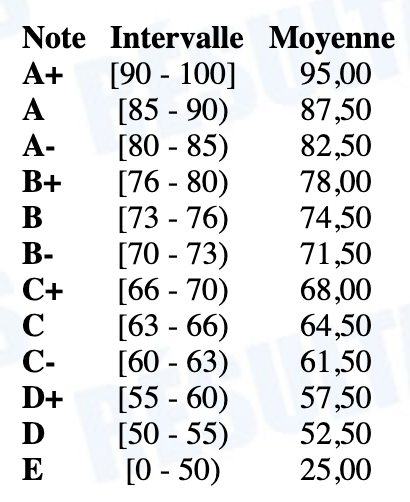

# INF5153 - Génie logiciel: Conception

## Informations Générales

  * Équipe :
    * Professeur : [Sébastien Mosser](https://mosser.github.io)
    * Démonstratrice : Charline David
    * Correcteur: _a définir_
  * Horaire du groupe `030`, session d'hiver 2019:
    * Cours : Mercredi, 18h - 21h, local PK-R605
    * Atelier : Jeudi, 18h - 20h, local PK-S1555
  * Communication :
    * Disponibilité sans rendez-vous : Mercredi, 15h45 - 17h45, local PK-4820
    * Slack : [https://inf5153-h19.slack.com/signup](https://inf5153-h19.slack.com/signup)
      * (**politique zéro courriel stricte**)

### Description du cours

_Sensibiliser l'étudiant aux difficultés de la conception et lui permettre d'élaborer des solutions réutilisables, maintenables et extensibles. Problématique du processus de conception. Critères et architecture. Conception comme activité créatrice. Outils d'aide à la conception. Intégration et essais système.
Conception orientée objet. Cadres d'application et patrons de conception. Documentation de conception. Rétro ingénierie._

  * Préalables académiques
    * [INF-5151](https://etudier.uqam.ca/cours?sigle=INF5151), Génie logiciel: analyse et modélisation ;
    * [INF-3135](https://etudier.uqam.ca/cours?sigle=INF3135), Construction et maintenance de logiciels.

### Évaluation & Planning de rendus

| Date(s)  | Travail à rendre | Objectif | Poids |
| :---:   | :---   | :---    | :---: |
| 16.01 ➝ 10.02 | TP1 |  Conception guidée, en lien avec l'implémentation | 10% |
| 20.02 | :notebook: **[Examen intra](./cours/07/h19_intra.pdf)** (PK-1350) | Principes fondamentaux de la conception | 20% |
| 28.02 ➝ 24.03 | TP2 - PMV | Concevoir et développer un produit minimal & viable  | 10% |
| 25.03 ➝ 28.04 | TP2 - Complet | Corriger une conception, intégrer des évolutions  | 20% |
| 24.04 | :notebook: **Examen final** (PK-1705) | Principes fondamentaux & avancés de la conception | 40% |

Pour les Travaux Pratiques, le rendu se fait à travers la plateforme GitHub Classroom. Les TPs sont a réaliser par équipe. Les dépôts de code seront clonés automatiquement par un script, et tout travail non rendu via ce biais ou hors délais ne sera pas évalué.  La couverture _fonctionelle_ de vos TPs est automatiquement vérifiée par la bonne exécution de scénarios _Cucumber_.

Les dates de remise s'entendent en Heure de l'Est, à 23:50 le jour de la date de remise.

L'examen _intra_ portera sur les séances des semaines #2 à #7. L'examen _final_ portera sur les séances des semaines #2 à #15. La séance de la semaine #16 est une ouverture pour votre culture générale. Pour les examens, vous avez le droit à une feuille de notes manuscrites (format _Letter_, recto-verso, écrite à la main et non photocopiée), et à la _cheatsheet_ UML donnée sur cette page.

## Agenda des séances

En régime régulier, les cours ont lieu le mercredi et les ateliers le jeudi. Les exceptions à la règle sont listées ci-dessous :

  - Semaine #6 : Déplacement pro (conférence). Le cours est remplacé par un atelier (_local & horaire à définir_).
  - Semaine #7 : L'atelier est remplacé par un cours pour rattraper la semaine 6 (_local & horaire à définir_)

| #Semaine | Cours (Mercredi, 3h) | Ateliers (Jeudi, 2h) |
| :---:   | :---   | :---    |
| #2      |  [Introduction: Socle Technique & Principes de COO](./cours/02) |   |
| #3      |  [Rappels sur UML, Pictionary](./cours/03) | (A1) Boite à outils  |
| #4      |  [Responsabilisation (GRASP & SOLID)](./cours/04)| (A1) _suite_ |
| #5      |  [Architecture & Conception détaillée](./cours/05) | (A2) Conception & Implémentation |
| #6      |  (A2) _suite_ | (A2) _suite_   |
| #7      |  :snowman: Tempête de Neige :snowman: | [Patrons de conceptions & Révisions](./cours/06) (PK-1620)  |
| **#8**  | **[Examen intra](./cours/07/h19_intra.pdf)** (PK-1350)  |   |
| _#9_    | _Semaine de relâche_   |   |
| #10     |  [Correction Intra & Tests d'acceptation](./cours/08) | (TP2) |
| #11     |  [Patrons de conceptions GoF (_padawan_)](./cours/09) | (TP2)  |
| #12     |  [Patrons de conceptions GoF (_chevalier_)](./cours/10) |  (TP2)   |
| #13     |  [Étude de cas JUnit (live coding)](./cours/11) |  (A3)  |
| #14     |  [Métriques, Visualisations & Anti-patrons](./cours/12) |  (A3)  |
| #15     |  [Ré-usinage & Mauvaises odeurs](./cours/13)  |  (TP2)   |
| #16     |  _Domain-driven design_, Étude de cas de révision | (TP2)   |
| **#17** |  **Examen final** (PK-1705) |  |

Materiel supplémentaire :

  * _Cheatsheet_ sur la syntaxe UML : [cheatsheet.pdf](./docs/cheatsheet.pdf)
      * autorisée au examens en plus d'une feuille de note manuscrites

  * Dépôts de code : 
      * [https://github.com/ace-lectures/pattern-repository](https://github.com/ace-lectures/pattern-repository)
      * [https://github.com/ace-lectures/inf5153-junit-demo](https://github.com/ace-lectures/inf5153-junit-demo) (Étude de Cas JUnit)

## Travaux

### Ateliers (encadrés)

  * A1 : [Micro-brasserie interactive](./ateliers/A1/README.md)
    * Objectifs : Maitriser l'outillage de base (GitHub classroom, travis-CI, maven, git, junit, visual paradigm & cucumber).
  * A2 : [Le jeu de Poker](./ateliers/A2/README.md)
    * Objectifs : Concevoir et développer une application orientée objet.
  * A3 : [Analyse qualité](./ateliers/A3/README.md)
    * Objectif : Initiation à la rétro-ingénierie des applications objets.

### Travaux pratiques (à rendre)

Les travaux pratiques sont a faire en équipe de 3 à 4 étudiants. Vous êtes fortement encouragés à utiliser Slack et les disponibilités sans rendez vous pour obtenir des retours sur vos
travaux pratiques avant les livraisons finales.

  * TP1 : [La Bibliothèque Universitaire](./tps/TP1/README.md)
  * TP2 : [La Fabrique de Biscuits ](/tps/TP2/README.md)
    * Version intermédiaire (24.03) : _Produit Minimal & Viable_
    * Version finale (28.04) : _Produit Complet_  

_Il est possible d'obtenir des créneaux de rendez-vous pendant les temps d'atelier avec le professeur pour discuter des
Travaux Pratiques à rendre **si vous êtes en situation d'emploi et ne pouvez pas venir sur le créneau sans rendez-vous précédant le cours**._

## Barème

Le cours utilise la grille d'évaluation standard de l'UQAM définie dans RESULTATS. La note de passage est de 50%, et il n'y a pas de double seuil TP/examens.

## Bibliographie

  * _UML@Classroom_, Springer Verlag, 2015.
    * Martina Seidl, Marion Scholz, Christian Huemer & Gerti Kappel.
  * _Software Systems Architecture: Working With Stakeholders Using Viewpoints and Perspectives_, Addison Wesley, 2011.
    * Nick Rozanski & Eoin (_pronounced “Owen”_) Woods.
  * _Implementing Domain-Driven Design_, Addison-Wesley Professional, 2013.
    * Vaughn Vernon
  * _Design Patterns: Elements of Reusable Object-Oriented Software_, Addison Wesley, 1994.
    * Erich Gamma, Richard Helm, Ralph Johnson & John Vlissides.
  * _Refactoring: Improving the Design of Existing Code_, Addison Wesley, 2018 (2nd edition)
    * Martin Fowler.  
