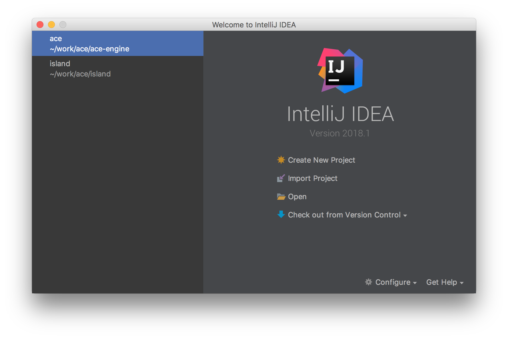
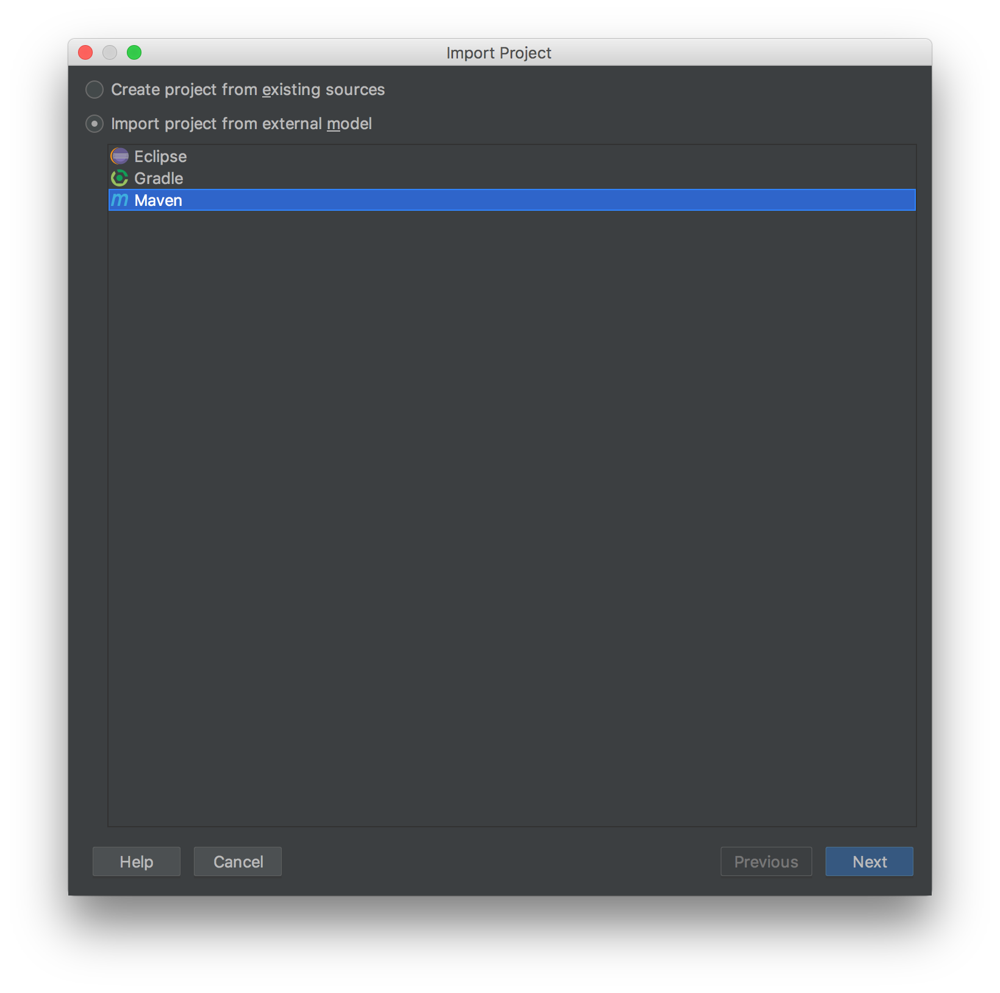
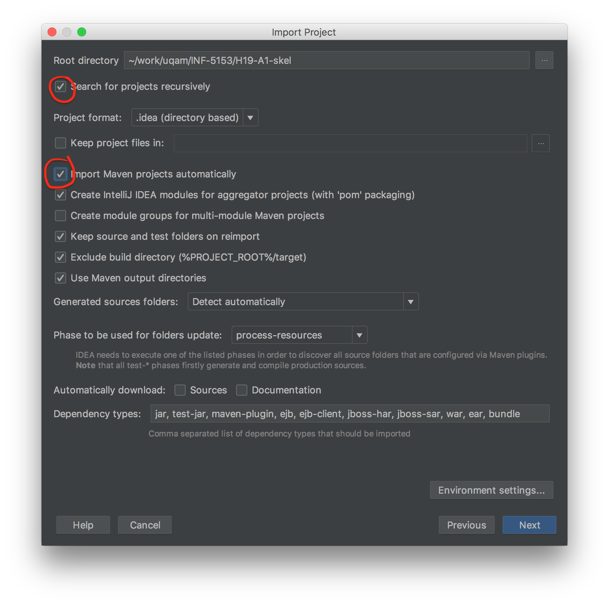
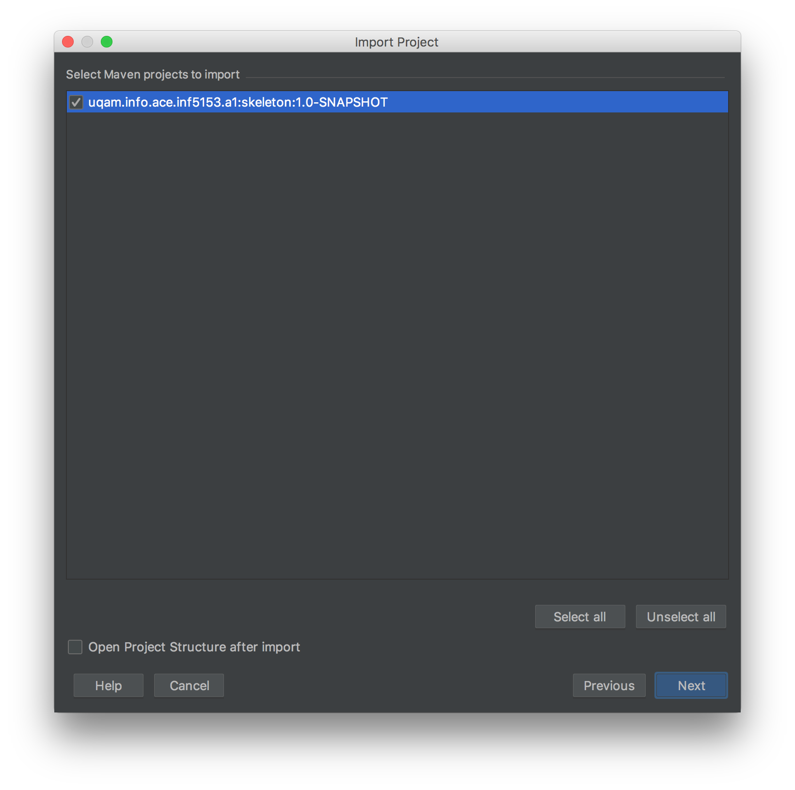
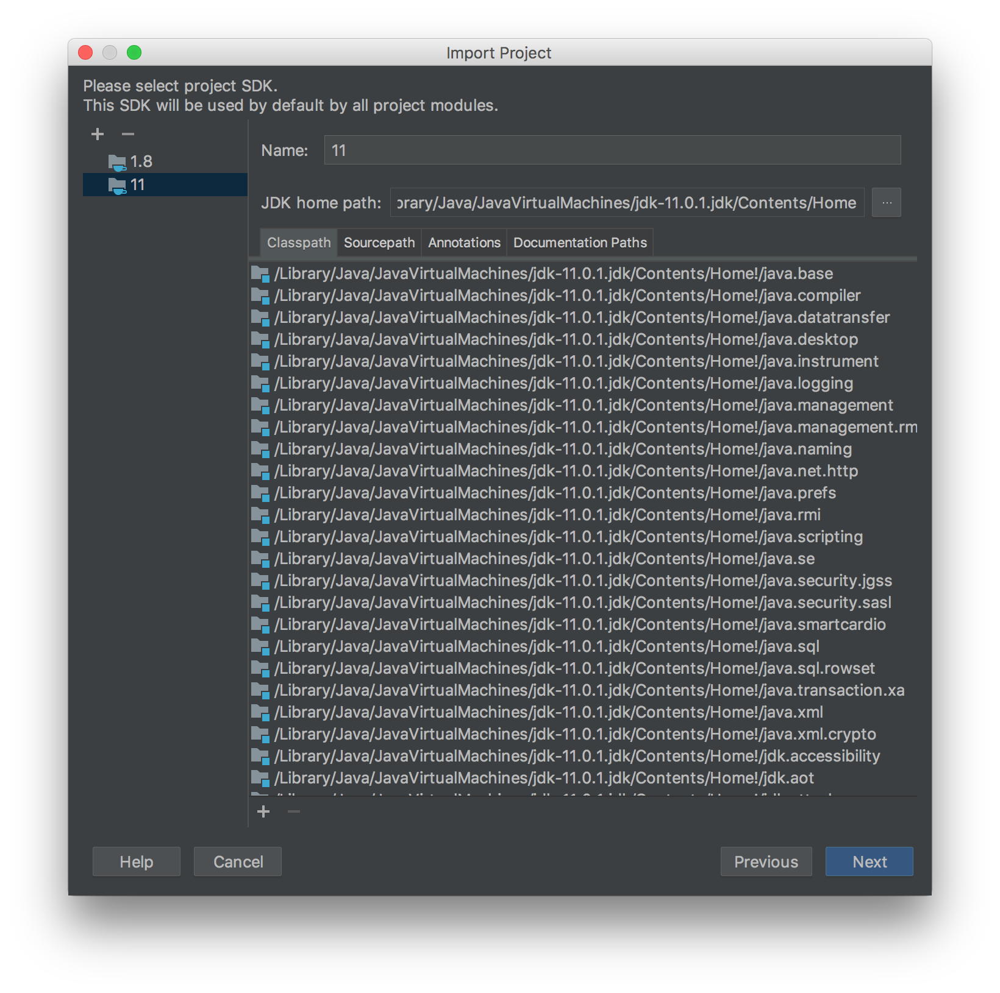

# Table de Restaurant Interactive (A1)

  * Auteur : [Sébastien Mosser](mosser@i3s.unice.fr)
  * Version : 2019.1
  * Durée : 2 sessions de 2h

## Objectifs

  1. Se rappeler les bases du développement orienté-objet en Java; 
  2. Prendre en main l'environnement technologique du cours INF-5153
    * Gestion de version avec Git et _Github Classroom_;
    * Maven pour la construction et l'exécution d'un projet;
    * Tests unitaires en JUnit.
  3. (Re-)découvrir les principes des tests d'acceptations et d'intégration continue
    * Tests d'acceptations avec Cucumber;
    * Intégration Continue avec Travis-CI. 
  4. Modéliser une application avec Visual Paradigm.

## Étape 0 : Installation des outils (à faire avant l'atelier)

Pour suivre le cours INF-5153, vous devez avoir à disposition : 

  * un compte sur la plateforme _Github_, qui vous permettra de rendre les travaux via son outil _GitHub Classroom_;
  * Java (version 11, _long term support_)
  * un gestionnaire de version Git, dans une version récente ;
  * une installation fonctionnelle de Maven, en version 3 ;
  * Un environnement de développement intégré (IDE) raisonnable (p. ex. IntelliJ ou Eclipse)
  * une installation de Visual Paradigm Community

## Étape 1 : Accepter le travail sur GitHub Classroom

  * Si ce n'est pas déjà le cas, créez un compte sur la plateforme [GitHub](http://github.com/)
  * Rendez vous sur la page du travail : 
    * [Travail A1 : Table Interactive](https://classroom.github.com/a/-sxrmGE9)
  * Acceptez le travail, et identifiez vous dans la liste en choisissant votre code permanent (attention à ne pas prendre le code d'un de vos collègue)
  * Vous obtenez un dépôt de code chez GitHub dédié à ce travail. 

Vous pouvez maintenant travailler sur cet atelier !

Dans un terminal, vous pouvez lancer la commande `mvn clean package`, qui va compiler le code source, exécuter les tests, et afficher le rapport dans le terminal.

N'oubliez pas de configurer Git pour que l'on puisse faire le lien entre votre travail sur cet atelier et votre identité.

```
$ git config user.email "courriel@courrier.uqam.ca"
$ git config user.name  "MonVraiPrénom MonVraiNom"
```

## Étape 2 : Importez le projet dans votre environnement

Le projet est géré à l'aide de Maven.

  * Regardez le contenu du fichier `pom.xml`, qui décrit le projet. 
  * Importez ce projet dans votre environnement de développement préféré. 
    * Vous trouverez en annexe à la fin de ce document les différentes étapes pour importer un projet Maven dans IntelliJ. 
    * Pour les utilisateurs d'Eclipse, il faut installer le plugin `M2Eclipse`.

:sweat: La plupart des environnement de développement propose un plugin pour le support de `Cucumber`, l'outil utilisé pour définir les scénarios d'acceptation. Contrairement à Junit, celui-ci n'est souvent pas installé par défaut.

## Étape 3 : État des lieux du système

Lisez le code source fourni à l'avance. 

En utilisant l'atelier de modélisation de votre choix (_p. ex._, Visual Paradigm), dressez un état des lieux du système. 

  * Dessinez le diagramme de cas d'utilisation du logiciel actuel;
  * Dessinez le diagramme de classes associé;
  * Dessinez le diagramme de séquence correspondant au cas d'utilisation "_Commander une boisson_".

Sur la base de ce constat : 

  * Listez les problèmes de conception qui sont présent dans ce code.

## Étape 4 : Évolution du système

Choisissez une des évolution proposée dans la liste de fonctionnalité manquante au système (voir le fichier `README.md`).

Pour cette évolution : 

  * Proposez un ré-usinage (_refactoring_) du code existant palliant les problèmes de conceptions associés à cette évolution uniquement;
  * Proposez une nouvelle version de vos diagrammes UMLs (cas d'utilisation, classes, et séquence(s));
  * Développez le code source qui permet de mettre en oeuvre votre évolution;
    * Ce code doit être équipé de tests unitaires JUnit;
  * Faites évoluer la base de test d'acceptation pour démontrer l'utilisation de votre modèle objet en support à la fonctionnalité développée.


:mailbox: Durant votre développement, à chaque `push` sur le dépôt GitHub, vous déclenchez un processus de construction et de test automatique de votre projet sur la plateforme [Travis](https://travis-ci.com/). 

  * Regardez le contenu du fichier `.travis.yml`.
  * Affichez l'état de votre projet sur [Travis](https://travis-ci.com/)
  * Modifiez le fichier `README.md` de votre projet pour pointer sur le badge de _build_ de votre projet.

  
## Étape 5 : Analyse de la qualité du code  

A chaque compilation via Maven, le système déclenche deux outils _simple_ et _basique_ d'analyse de qualité du code : 

  * `JaCoCo`, pour _Java Code Coverage_, un outil analysant la couverture de tests du projet. Vous trouverez le rapport dans le fichier `target/site/jacoco/index.html`
  * `PMD`, un analyseur statique de code source. Vous trouverez les résultats de son analyse dans le fichier `target/site/pmd.html`.

Regardez les rapports qui sont générés pour votre projet.

  * Ces outils sont ils utile à maintenir de la qualité dans le code développé ?
  * Comment les mettez vous en lien avec l'activité de conception ?

  
## Annexes

### Annexe 1 : Importation d'un projet Maven dans IntelliJ

<div align="center">













</div> 
  
     