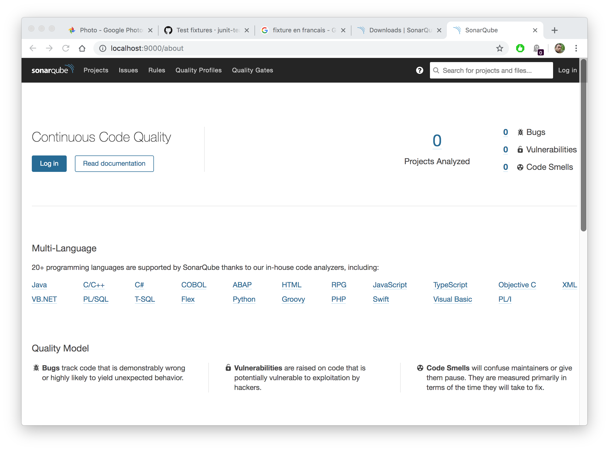
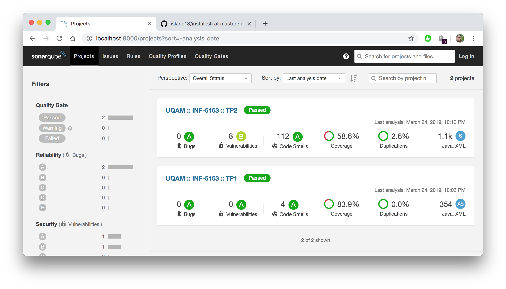
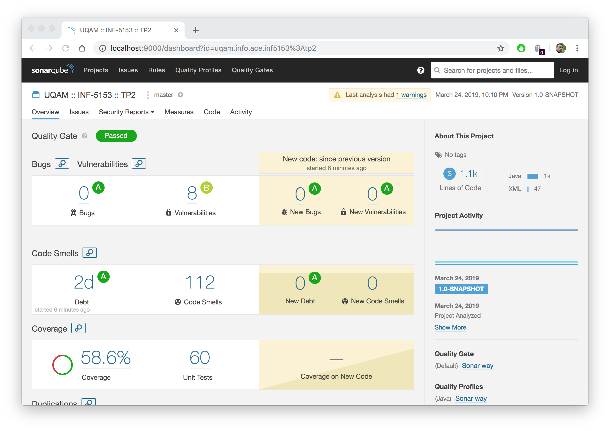
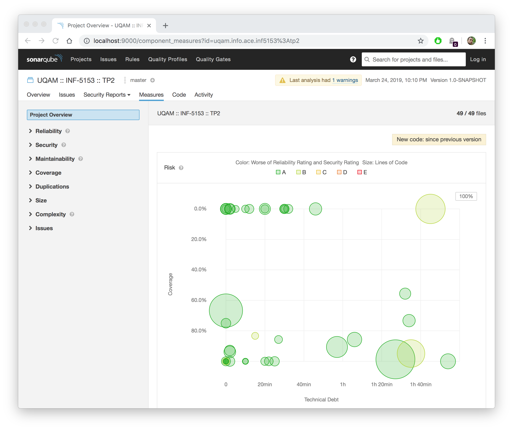
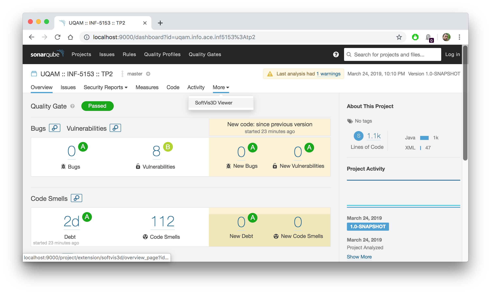
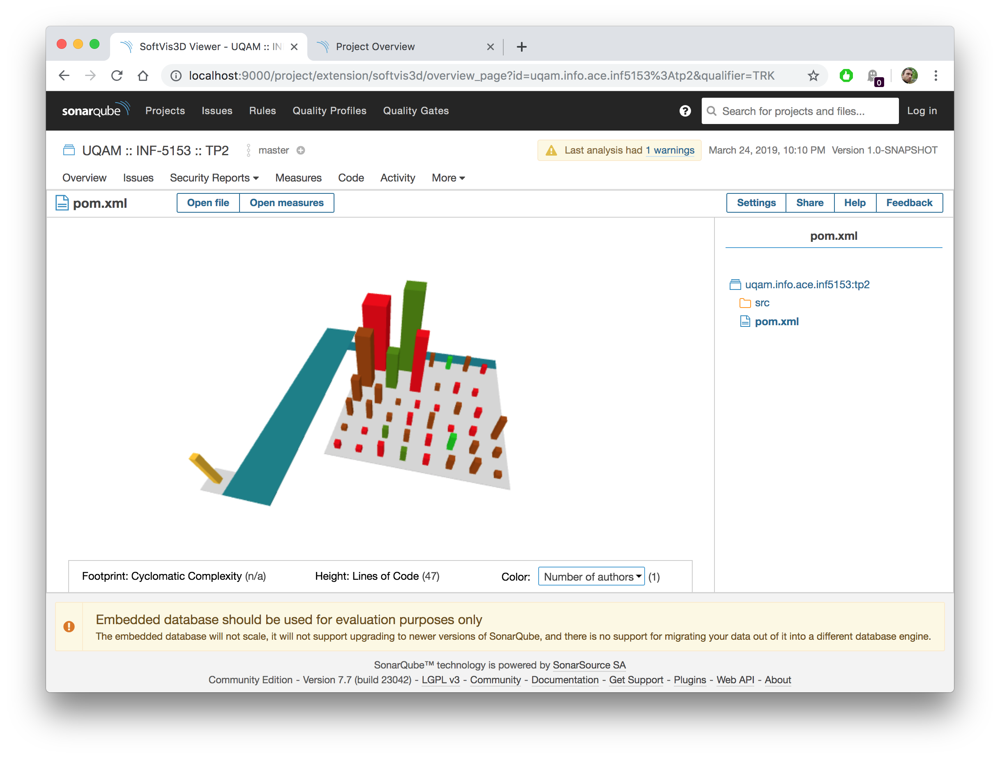

# Atelier A3 : Analyse Qualité

  * Auteur : [Sébastien Mosser](mosser@i3s.unice.fr)
  * Version : 2019.03
  * Durée : 2 sessions de 2h 

### Objectifs

  1. Installer un outil d'analyse qualité
  2. Analyser un projet Java du point de vue de la qualité
  3. Résoudre dans le projet les principaux problèmes de qualité.
  
## Installation de la chaîne d'analyse
 
### Téléchargement et installation de Sonarqube

L'outil Sonarqube est une des références industrielle en analyse de qualité. S'il est loin d'être parfait, il combine dans un environnement modulaire un ensemble d'analyse couvrant la plupart des besoins en analyse qualité.

  1. Téléchargez SonarQube en version _Community Edition_ 7.7 
    * https://www.sonarqube.org/downloads/ (attention, ~200Mb)
  2. Extrayez le contenu de l'archive (avec la commande `unzip` par exemple)
  3. Rendez vous dans le repertoire `sonarqube-7.7/bin/xxx`, où `xxx` est votre système d'exploitation
  4. Lancez le serveur d'analyse avec la commande adéquate.  
    * Pour windows, `StartSonar.bat`
    * Pour unix (linux & Mac OS), `./sonar.sh start`

```
lucifer:macosx-universal-64 mosser$ ./sonar.sh start
Starting SonarQube...
Started SonarQube.
lucifer:macosx-universal-64 mosser$ 
``` 

Une fois le serveur lancé, vous pouvez ouvrir un butineur et vous rendre à l'adresse `http://localhost:9000` pour voir l'outil en action sur votre machine.

<div align="center">



</div>


### Analyse de votre projet par Sonar

On va exploiter la structure modulaire de Maven pour lier votre projet à Sonar. Pour analyser votre projet (sans avoir a modifier votre `pom.xml`), il vous suffit de lancer les commandes suivantes :

```
lucifer:macosx-universal-64 mosser$ mvn org.jacoco:jacoco-maven-plugin:prepare-agent clean verify
...
lucifer:macosx-universal-64 mosser$ mvn sonar:sonar
```

## Exploitation de la chaine d'analyse

Une fois votre projet analysé, il est disponible dans l'interface web.

<div align="center">



</div>


### Violation de qualité générale

En cliquant sur le nom de votre projet, vous pouvez récupérer une analyse détaillée de sa qualité.

<div align="center">



</div>

Explorer l'interface à votre disposition pour explorer la qualité de votre projet. Regardez principalement les problèmes remontés pour les catégories `Bug`, `Vulnerability`,  `Debt` et `Code Smell`. 

  - Est-ce que tout ces problèmes en sont vraiment ? 
  - Pouvez vous fixer ceux qui le sont ? 
  - Avez vous une idée de pourquoi les autres sont détectés ?


### Analyse de métriques

Basculez dans l'onglet `Measures`.

<div align="center">



</div>


Explorez les différents diagrammes (ou listes) générés par l'outil pour regarder la qualité de votre code actuel


## Visualisation de code avec CodeCity

CodeCity est une approche de visualisation de code qui exploite la _métaphore de la ville_ pour visualiser un code source. Elle à aussi la bonne propriété d'être implémenté dans beaucoup d'outils, et disponible comme un plugin de Sonar.

  1. Connectez vous en tant qu'administrateur (menu `Log in`, par défaut `admin` en nom d'utilisateur et `admin` en mot de passe).
  2. Allez dans l'onglet d'administration générale (tout en haut dans le bandeau noir), et choisissez `MarketPlace`
  3. Recherchez le _plugin_ appelé `Softvis3D`, et installez le.
  4. Relancez le serveur depuis l'interface web quand il vous en fait la demande
  5. Reconnectez vous au besoin (vous pouvez aussi aller sut http://localhost:9000)

### Calcul de la visualisation

Retournez sur la page de votre projet, et choisissez maintenant dans l'onglet `More` la vue `3D code metrics`.

<div align="center">



</div>

Chargez la vue par défaut, et utilisez là pour identifier des défauts de conception dans votre projet. 


<div align="center">



</div>


Exploitiez les différentes possibilité de configuration de la métaphore pour auditeur votre système.
