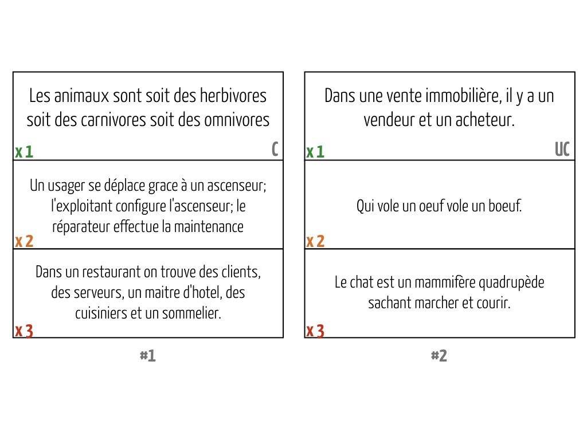
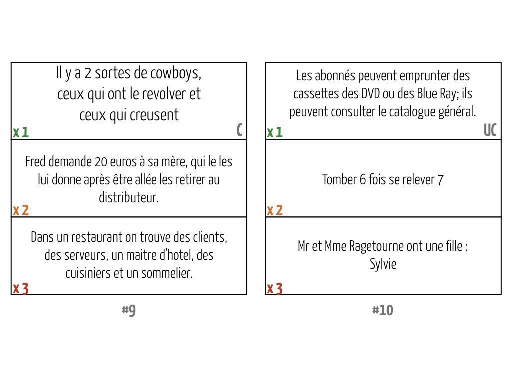
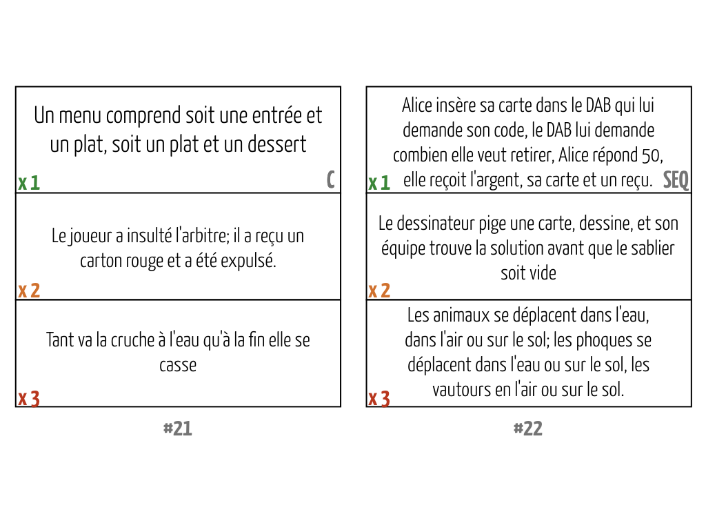
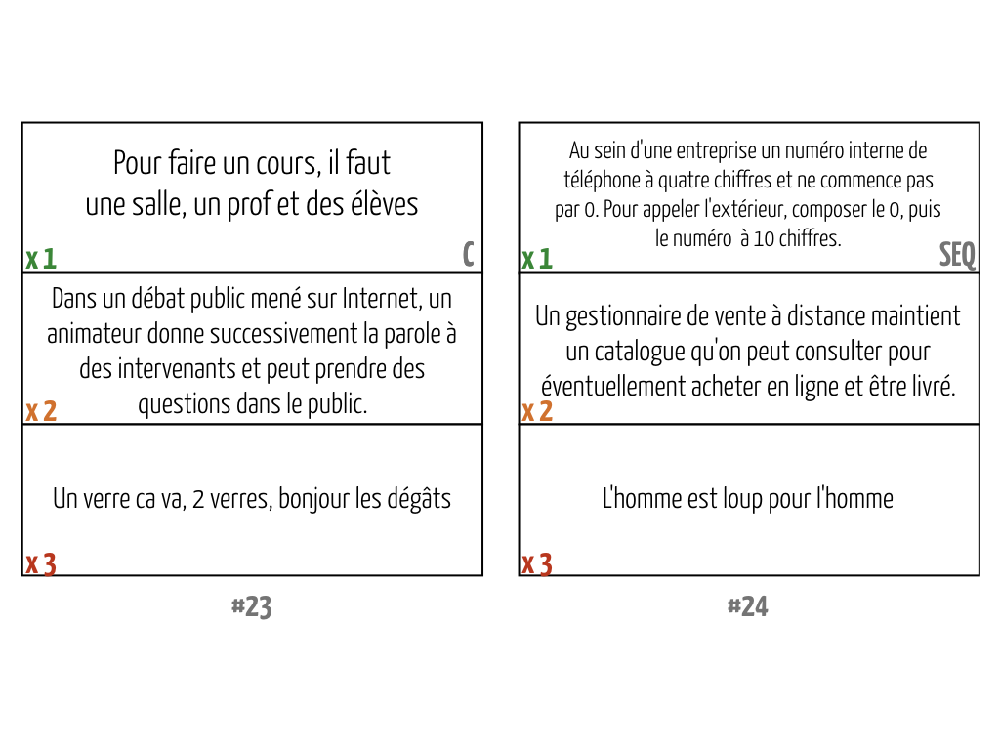
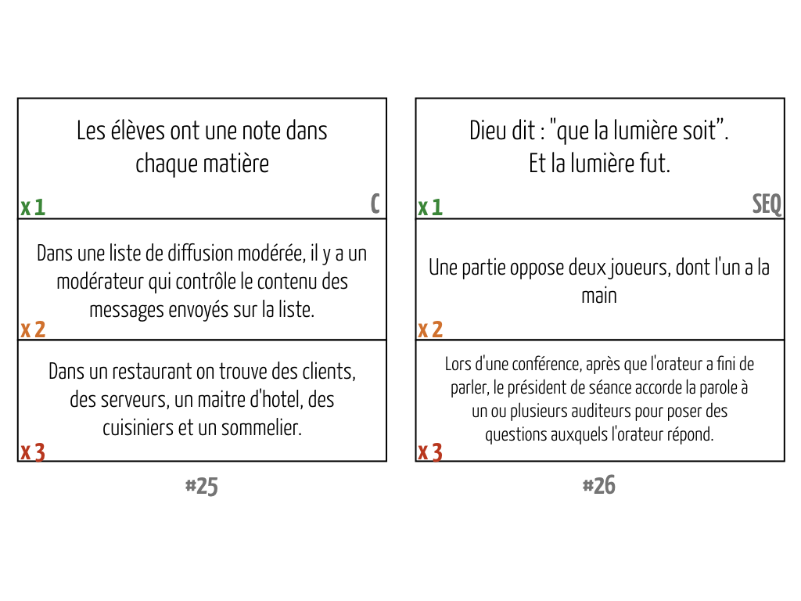
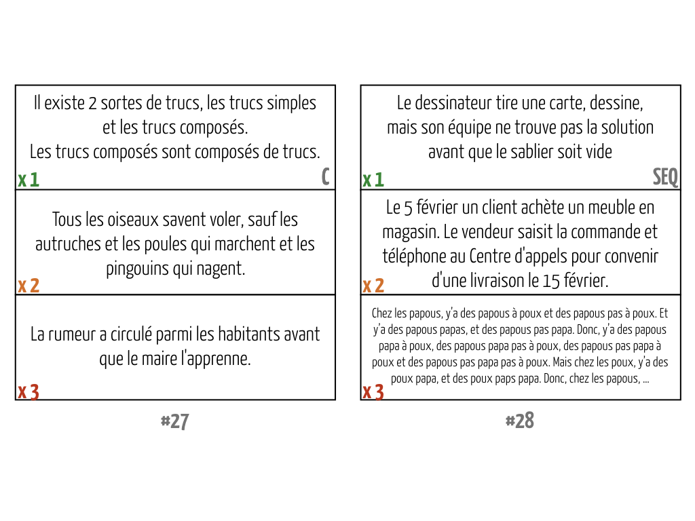
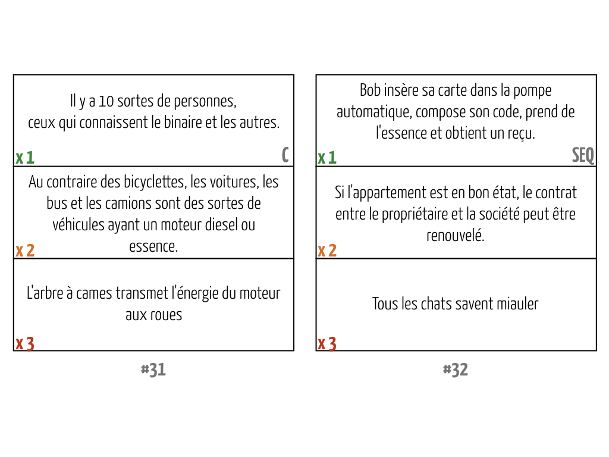

# Pictionary UML

  * Auteurs : Équipe Diverse, Université Rennes 1
  * Version adaptée pour le cours INF 5153 de l'UQAM, Hiver 2019

## Mode d'emploi

  - Rejoignez le canal `#pictionary` sur l'équipe Slack de la session;
  - Proposez votre solution pour une des 42 phrase disponible en la prenant en photo et en l'envoyant sur le canal;
  - Discutez entre vous de la proposition faite (_p. ex._ faites un fil de discussion sous l'image).
  - Pour chaque proposition faite, je posterais ma proposition en complément de vos discussions (qui est elle aussi discutable :innocent:).

## Cartes disponibles

